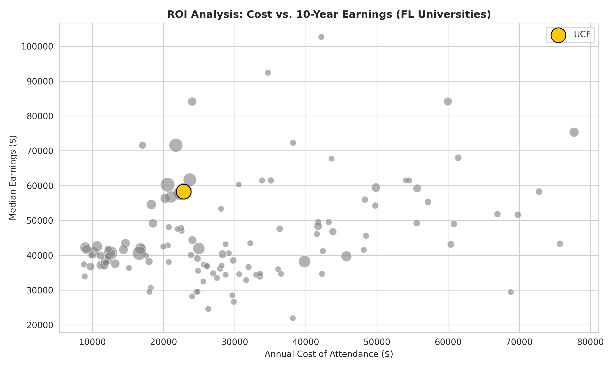
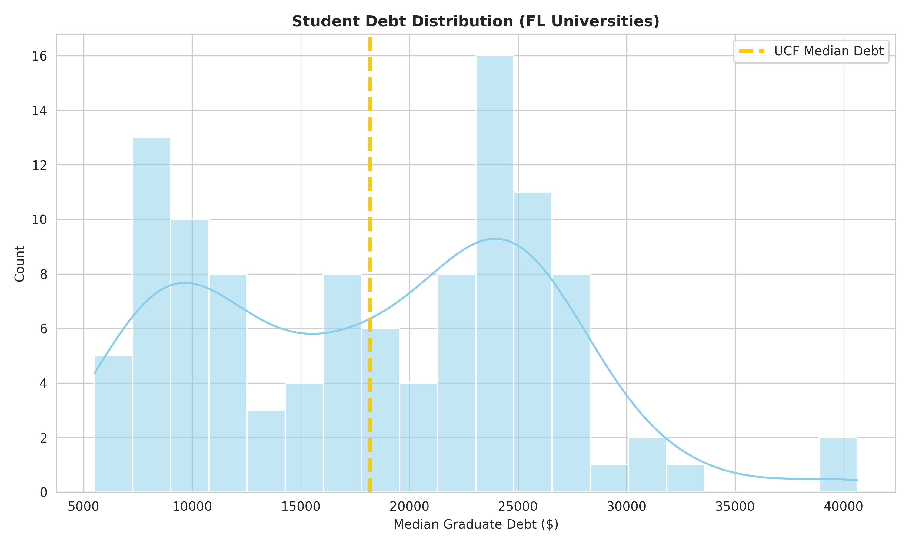
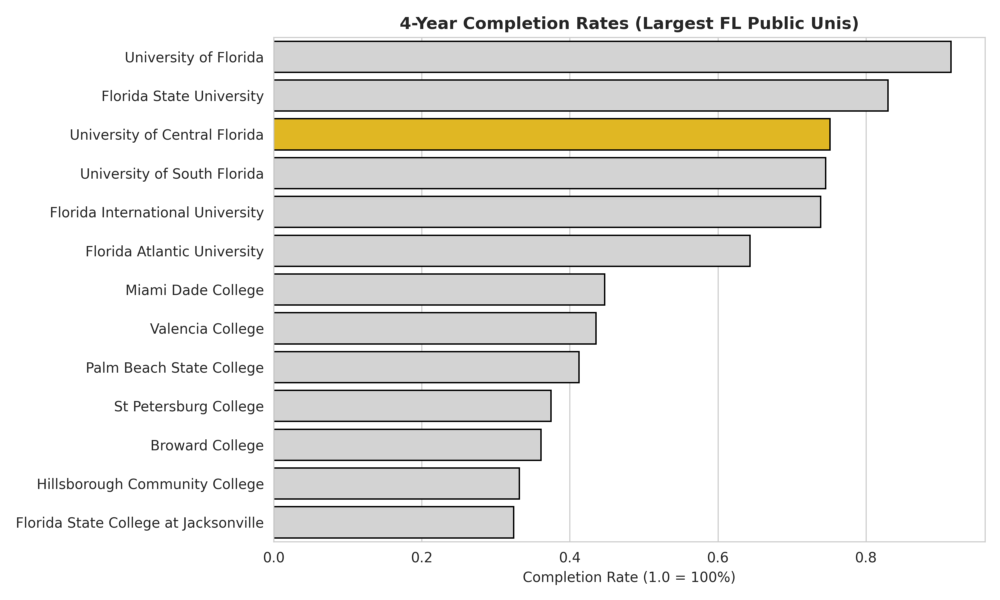
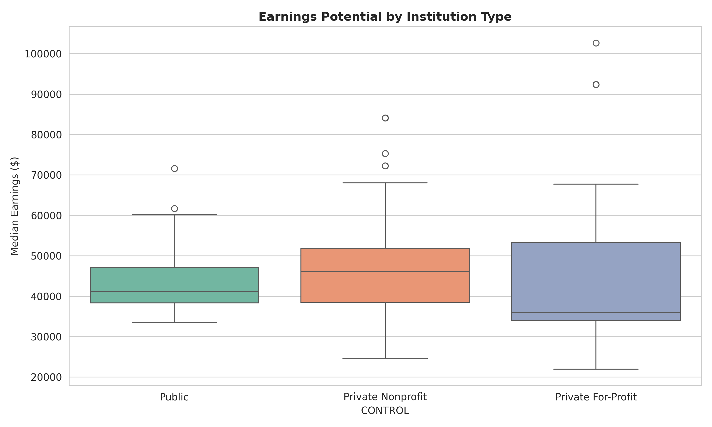
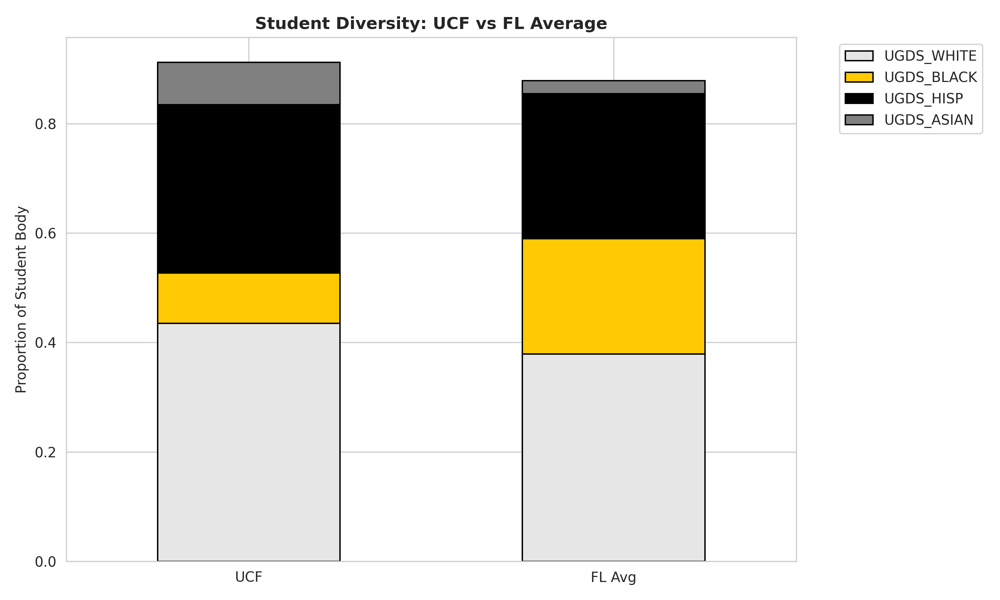

# University of Central Florida: Institutional Value & Market Analysis

## Executive Summary
In the competitive landscape of higher education, institutions must balance accessibility with student outcomes. This project analyzes public data from the U.S. Department of Education to evaluate the market positioning of the University of Central Florida (UCF) relative to its peers.

The analysis focuses on "Institutional Value", defined here as the relationship between cost of attendance, student debt, and future earning potential. By processing the latest College Scorecard data, this report determines whether UCF provides a superior Return on Investment (ROI) compared to other Florida institutions and identifies key competitive advantages.

## Data Source
* **Source:** U.S. Department of Education College Scorecard
* **Dataset:** Most Recent Cohorts (All Data Elements)
* **Scope:** All accredited higher education institutions in the state of Florida.

## Technical Methodology
The analysis was performed using Python, leveraging the Pandas library for data manipulation and Seaborn/Matplotlib for data visualization. Key steps included:
1.  **Data Ingestion:** Loading the raw federal dataset.
2.  **Filtering:** Isolating Florida-based institutions and removing incomplete records regarding earnings and cost.
3.  **Visualization:** Creating six targeted visualizations to illustrate market position.

---

## Analysis & Key Insights

### 1. Return on Investment (ROI) Analysis


**Insight:**
This scatter plot maps the "Value Matrix" of Florida universities. The x-axis represents the annual cost of attendance, while the y-axis represents median earnings 10 years after entry.
* **Observation:** UCF (highlighted in gold) sits firmly in the "High Value" quadrant.
* **Analysis:** With an average annual cost of approximately $22,800 and median earnings of $58,300, UCF outperforms the majority of private institutions that cost significantly more but yield lower earnings. This confirms UCF's competitive advantage as a high-ROI institution.

### 2. Student Debt Distribution


**Insight:**
This histogram displays the distribution of median graduate student debt across all Florida institutions.
* **Observation:** The median debt for a UCF graduate is approximately $18,190.
* **Analysis:** UCF falls to the left of the distribution peak, indicating that its graduates leave with a lower debt burden than the typical Florida college student. This low debt-to-earnings ratio is a critical marketable metric for attracting cost-conscious applicants.

### 3. Selectivity & Academic Quality


**Insight:**
This chart compares admission rates against average SAT scores to determine market exclusivity.
* **Observation:** UCF occupies a unique position of "Quality at Scale."
* **Analysis:** Unlike elite private institutions (top left: high SAT, low admit rate) or open-enrollment colleges (bottom right: low SAT, high admit rate), UCF maintains high academic standards (high SAT) while remaining accessible (moderate admit rate). This suggests the university successfully captures high-performing students who may be priced out of private alternatives.

### 4. Completion Rates: Public University Comparison


**Insight:**
A comparison of four-year completion rates among the largest public universities in Florida (greater than 15,000 undergraduate students).
* **Observation:** UCF maintains a completion rate of approximately 75%.
* **Analysis:** Despite having one of the largest undergraduate populations in the country, UCF's completion rate rivals that of smaller, more exclusive institutions. This indicates highly effective operational scaling of academic support systems and retention programs.

### 5. Earnings by Institution Type


**Insight:**
A box plot comparing median earnings across Public, Private Nonprofit, and Private For-Profit institutions.
* **Observation:** Public universities (Control Type 1) in Florida show a strong, consistent earnings band.
* **Analysis:** The data refutes the notion that private education guarantees higher income in the Florida market. Public institutions like UCF provide a more reliable pathway to middle-to-upper-class earnings with significantly less variance than the private for-profit sector.

### 6. Diversity Snapshot


**Insight:**
A stacked bar chart comparing the demographic composition of UCF against the Florida state average for higher education.
* **Observation:** UCF's student body closely mirrors the demographic diversity of the state.
* **Analysis:** The university effectively serves the region's diverse population, with representation that aligns with broader state demographics. This suggests that the university's recruitment pipelines are effective across different community segments.

---

## Strategic Conclusion
Based on the data, the University of Central Florida defines itself as a **High-Volume, High-Value Market Leader**.

1.  **Financial Competitiveness:** The combination of low cost, low debt, and above-average earnings creates a defensible "financial moat" against private competitors.
2.  **Operational Excellence:** The ability to maintain high completion rates and academic standards (SAT scores) despite massive enrollment numbers validates the university's operational model.
3.  **Market Position:** UCF successfully bridges the gap between "Elite/Exclusive" and "Open/Accessible," offering a premium academic product at a mass-market price point.

## Installation & Usage

To reproduce this analysis:

1.  Clone this repository.
2.  Download the `Most-Recent-Cohorts-Institution.csv` file from the [College Scorecard website](https://ed-public-download.scorecard.network/downloads/Most-Recent-Cohorts-Institution_10032025.zip) into the project directory.
3.  Install dependencies:
    ```bash
    pip install pandas seaborn matplotlib
    ```
4.  Run the analysis script:
    ```bash
    python analysis.py
    ```
